<h1>Clone do site da Porsche Stuttgart</h1>

  

<h3>Esse projeto foi desenvolvido com o objetivo de aperfeiçoar as minhas habilidades em Design de sites e Desenvolvimento FrontEnd, mais especificamente em ReactJS e React Router.</h3>
 

  <h2 align="center">Página Principal</h2>
  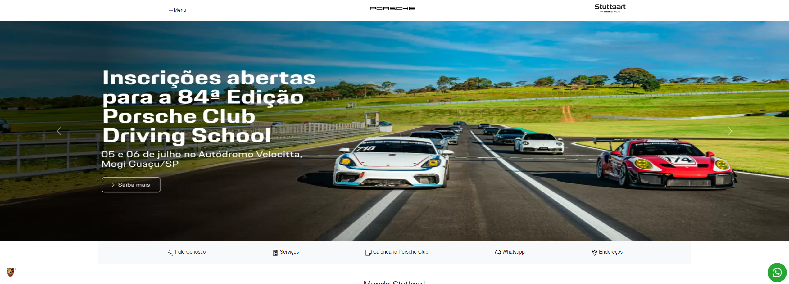
  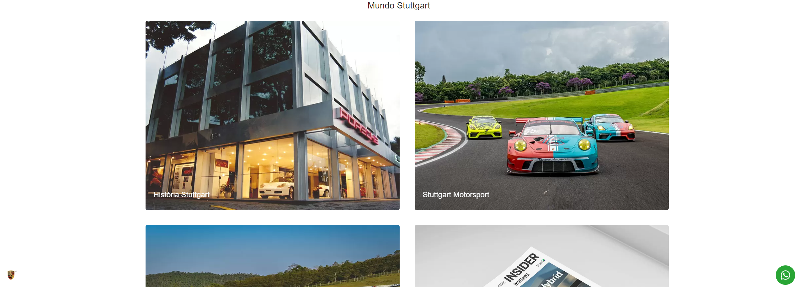
  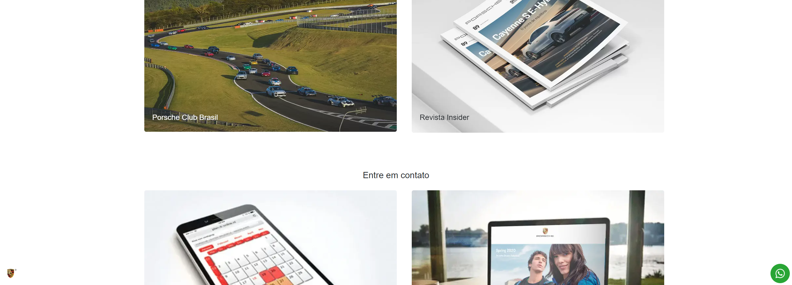
  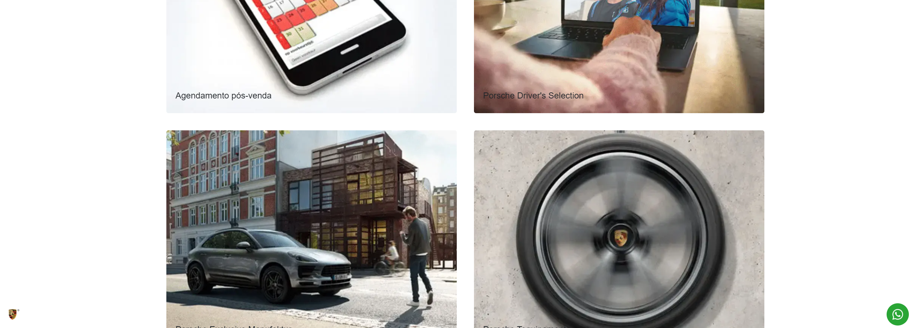
  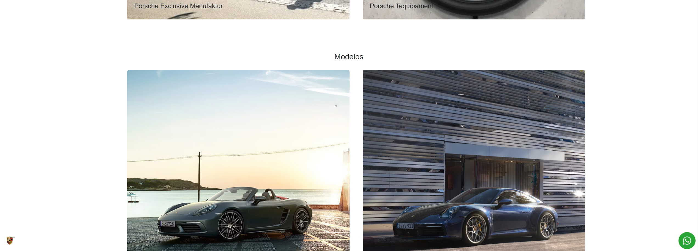
  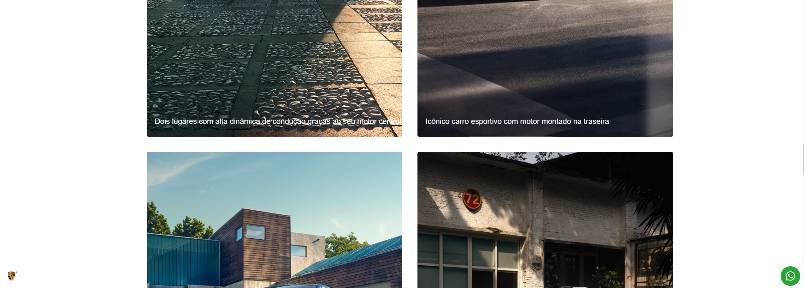
  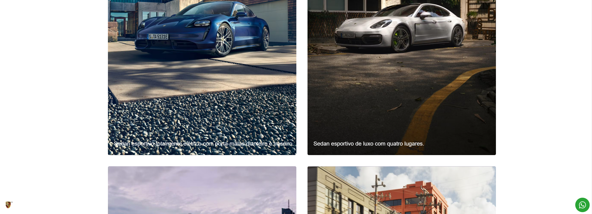
  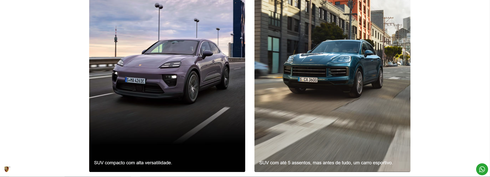
  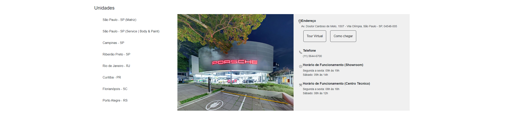
  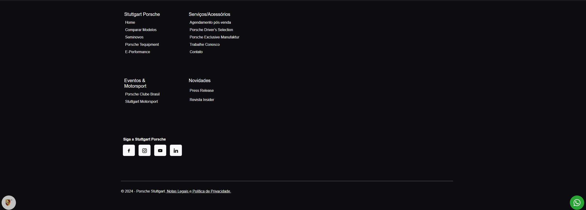

 

  <h2 align="center">Página Secundária</h2>
  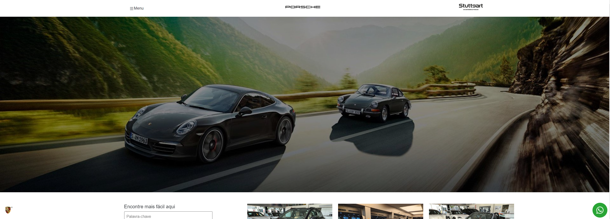
  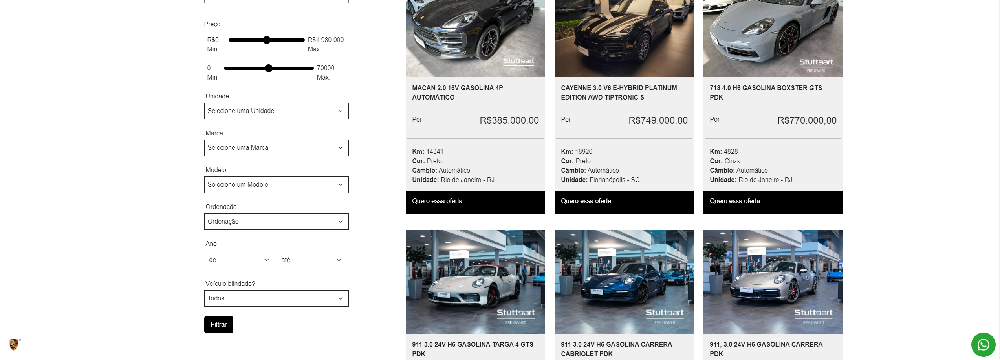
  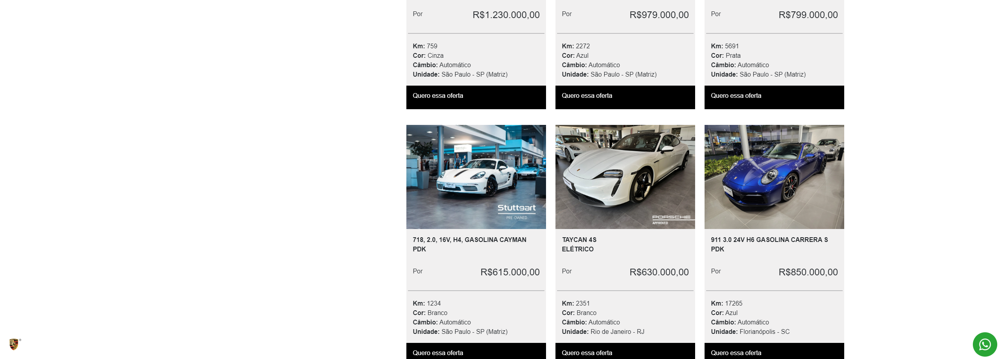
  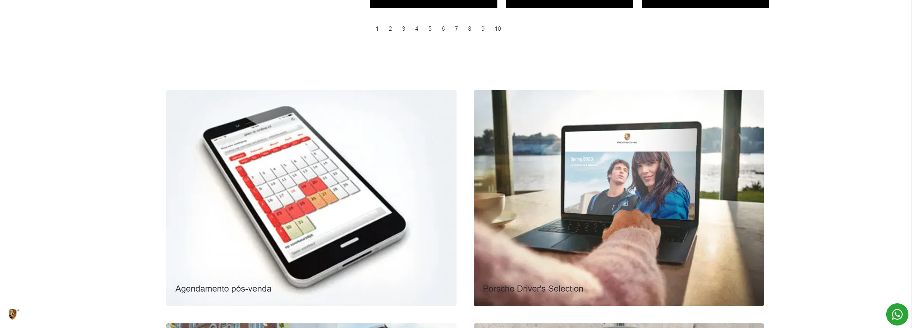
  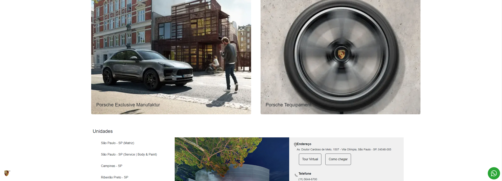
  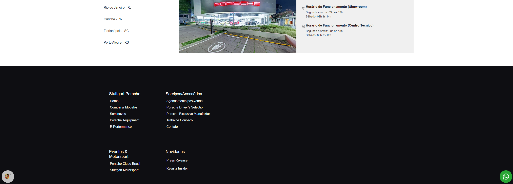
  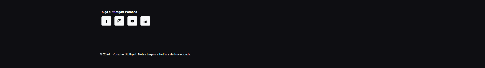

